# 🛒 Amazon Clone – React E-Commerce Frontend

An Amazon-inspired responsive **E-Commerce website** built using **React**, **Bootstrap**, **JavaScript**, and **LocalStorage**. This project simulates real-world shopping features like cart, checkout, theme switching, and user authentication.

---

## 🚀 Live Demo

🔗 [**View Live on Netlify**](https://azcloneecommercee.netlify.app/)  
📁 [**Source Code on GitHub**](https://github.com/spoorthyspoorthyms/Amazon-Clone)

---

## 📸 Screenshots

###  full home Page  
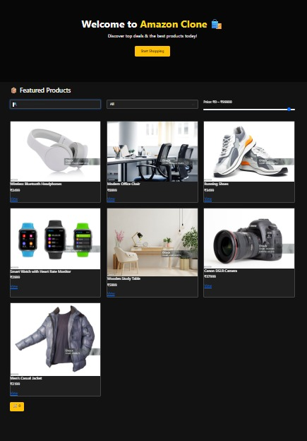
Description:
The homepage showcases a dynamic product listing with featured banners and categories. It includes a responsive navbar with cart and theme toggle options. Products are displayed with images, prices, and "Add to Cart" buttons, all styled using Bootstrap for a clean layout.

### 🛒 empty cart  
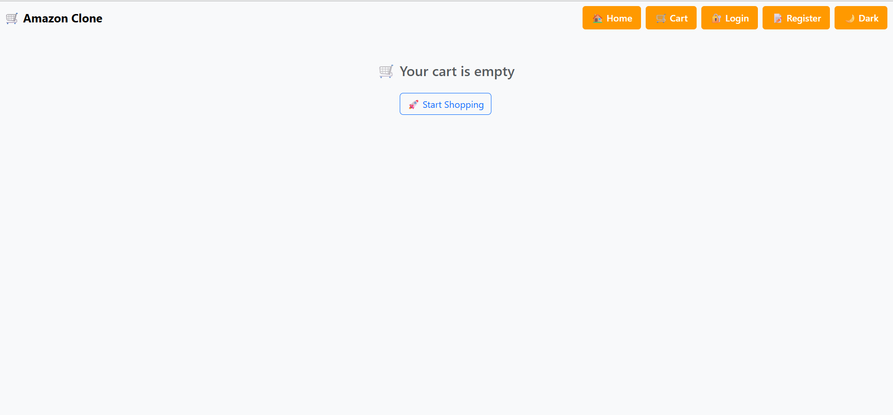
Description:
The cart page displays a clear "Your cart is empty" message when no items are added. It maintains a clean layout with a disabled checkout button and prompts users to explore products. This ensures a smooth user experience even when the cart has no items.

### 🔐 Login Page  
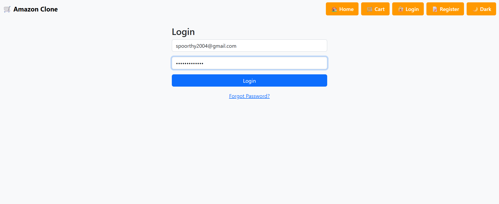
Description:
The login page provides a simple and intuitive interface for user authentication. It includes input fields for email and password with basic validation. Designed with responsive Bootstrap styling, it ensures accessibility across all devices.

### 🌙 darktheme 
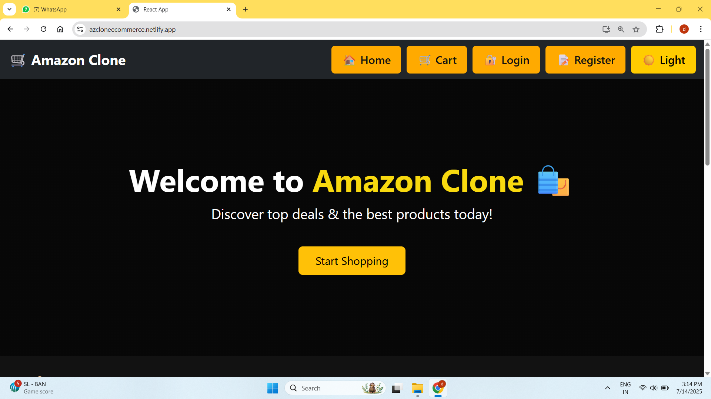
Description:
The dark theme offers a visually appealing and user-friendly interface for low-light environments. It dynamically switches styles using the Context API, preserving state across sessions. All components, including navbar, cards, and buttons, adapt seamlessly to the dark mode.

### ☀️ Lighttheme  
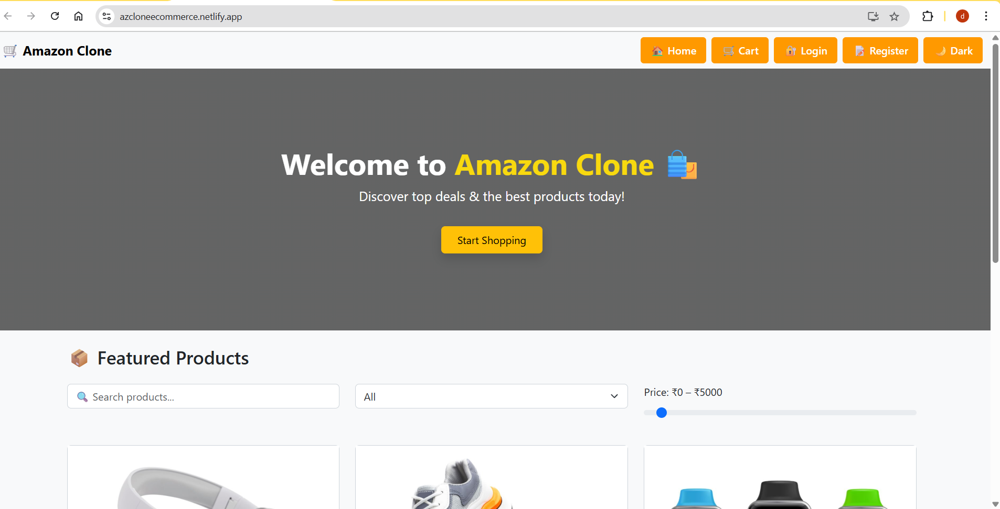
Description:
The light theme provides a clean and modern look with bright backgrounds and high readability. It’s the default appearance, ensuring a welcoming interface for all users. The layout and components stay fully responsive and consistent across devices.

### 📝register Page  
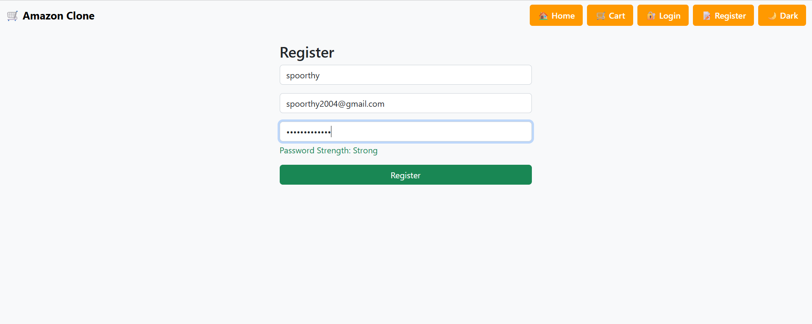
Description:
The register page allows new users to sign up with their name, email, and password. It includes client-side validation and a user-friendly layout for quick account creation. The design ensures seamless integration with the login and authentication flow.

###  🔑 forgot password Page  
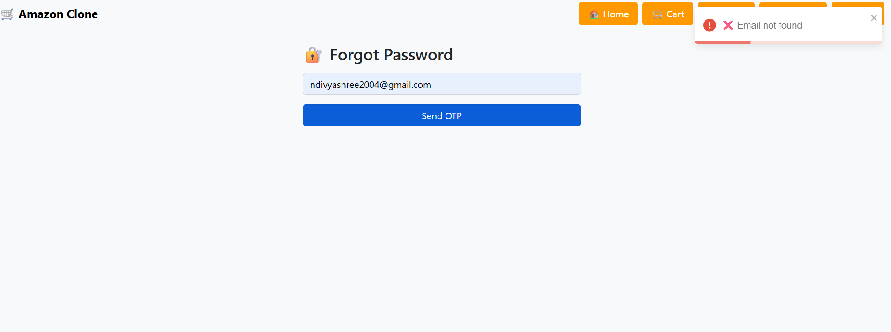
Description:
The forgot password page helps users recover access by entering their registered email. It features a minimal and clean design with proper form validation. This page enhances user experience by handling login issues gracefully.

### 🛒 Logged in Page  (cart)
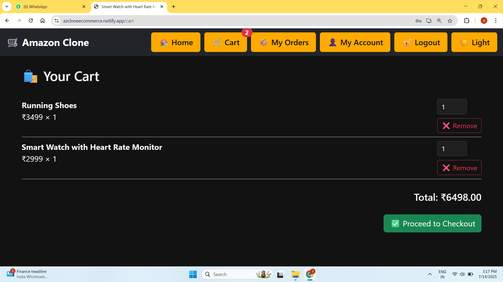
Description:
Once signed in, the cart page displays all selected items with images, names, prices, and quantity controls. Users can increment, decrement, or remove items instantly, with the total amount updating in real time. The page retains a consistent layout and theme toggle, ensuring a seamless shopping experience.

### 🚫 not Logged in Page  
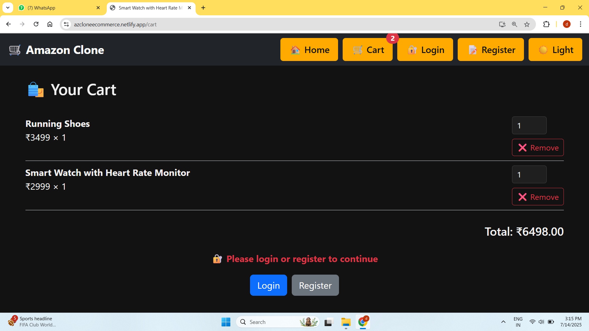
Description:
When a user is not logged in, the cart page prompts them to sign in before proceeding to checkout. This ensures that only authenticated users can place orders. The cart items remain stored temporarily using localStorage, preserving selections after login.

### 👤 myaccount Page  

Description:
The My Account page displays the logged-in user's profile details, including name, email, and profile image. It offers a personalized dashboard-like experience for users to manage their information. The layout is clean, responsive, and integrates smoothly with the authentication flow.

### 💳 billinginfo
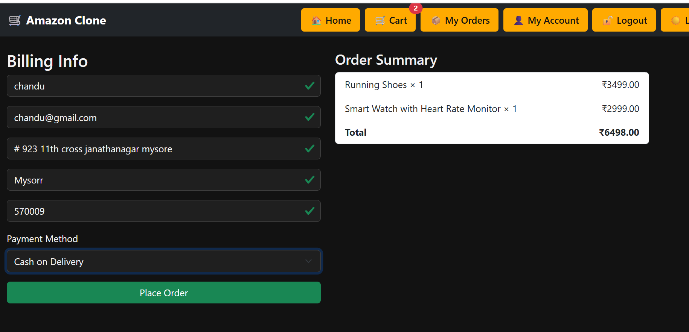
Description:
The Billing Information section captures essential user details like name, address, contact, and payment preferences during checkout. It includes real-time validation to ensure accurate and complete inputs. Designed for clarity and ease of use, it streamlines the final purchase process.

### 📦 myorder Page  
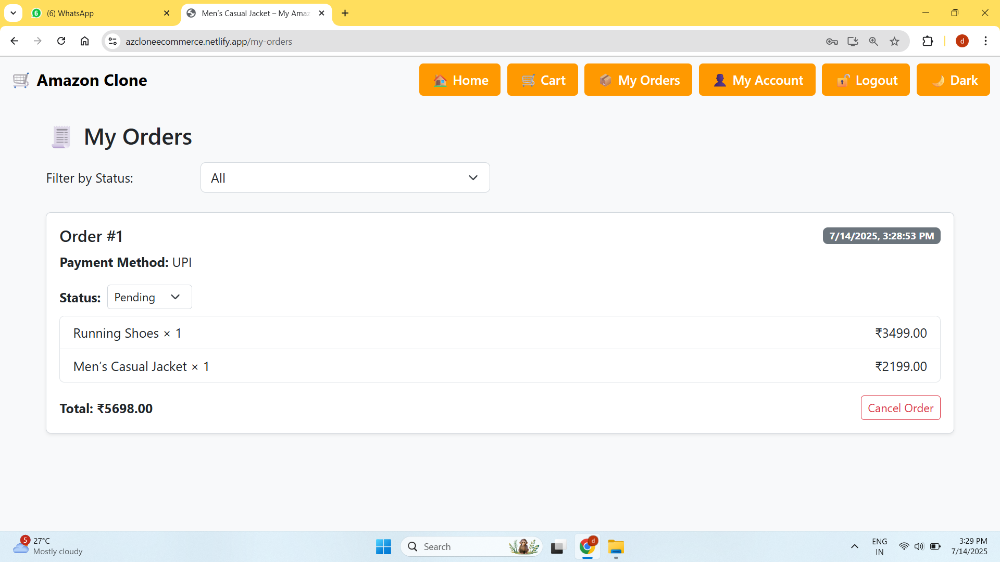
Description:
The My Orders page provides users with a history of their completed purchases, including product details and order status. It helps users track past transactions in an organized and readable format. This section adds a professional touch to the user experience, mimicking real-world e-commerce platforms.

### 🛍️ product Page  
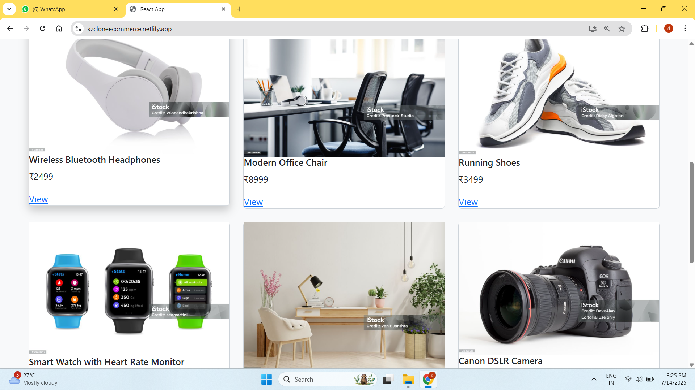
Description:
The Product Page showcases detailed information about a selected item, including image, description, price, and category. Users can view product specifications and add the item directly to their cart. Styled with Bootstrap and responsive design, it ensures smooth browsing on all devices.

---

## 🧰 Tech Stack

-  **React JS** – Functional components, Hooks, Routing
-  **Bootstrap 5** – Responsive UI styling
-  **React Context API** – Global state (theme & cart)
-  **LocalStorage** – Data persistence across sessions
-  **React Router DOM** – Navigation & routing
-  **React Toastify** – Alerts and feedback messages
-  **CSS3** – Animations, hover effects

---

##  Key Features

- ✅ **Product Listing** with image, price & category
- ✅ **Add to Cart** and quantity management
- ✅ **Persistent Cart** using localStorage
- ✅ **Dark/Light Mode** toggle
- ✅ **Login/Register system** (no backend)
- ✅ **My Account**: profile info & image
- ✅ **My Orders**: order history tracking
- ✅ **Responsive Design** – mobile/tablet/desktop friendly
- ✅ **Search + Filter** by category & price
- ✅ **Checkout Page** with validation
- ✅ **Spinner Loader** during initial load
- ✅ **Error Boundary** for catching React errors

---

## 📂 Project Structure

amazon-clone/
├── public/
├── src/
│ ├── components/# Navbar, Banner, ProductCard, etc.
│ ├── context/ # ThemeContext, CartContext, ProductContext
│ ├── data/ # Home, CartPage, Login, Register, MyAccount
│ ├── pages/ # Static product data (JSON)
│ ├── styles/ # Global styles & CSS
│ ├── App.js # Main route definitions
│ ├── index.js
│ └── ...
├── README.md
└── package.json

---

## 🔐 Authentication & Cart Logic

-  Users **cannot** access checkout without logging in.
-  Cart **works before login**, but prompts login on checkout.
-  Smart logic checks cart + auth status at runtime.

---

##  Future Enhancements

-  Backend integration with Firebase or Express
-  Payment gateway (Stripe or Razorpay)
-  Email & OTP using **EmailJS**
-  Admin Dashboard (CRUD for products)

---

##  Learning Outcomes

- ✅ Mastered **React Hooks** (`useState`, `useEffect`, `useContext`, `useParams`)
- ✅ Implemented **Component-based Architecture**
- ✅ Handled **client-side routing** and navigation
- ✅ Gained experience with **form validation & UX**
- ✅ Understood **global state with Context API**
- ✅ Practiced **responsive design principles**

---

##  Developed By

**Spoorthy M S**  
🎓 Computer Science Student – Vidyavardhaka College of Engineering    

---

